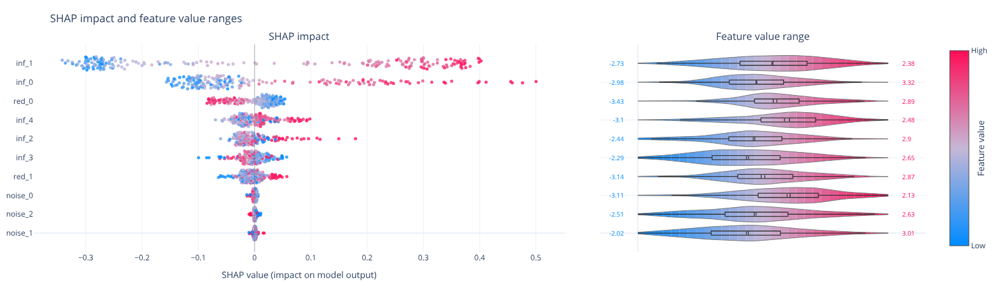

# shaply

[](https://github.com/antoine126/shaply/actions/workflows/tests.yml)
[](https://codecov.io/gh/antoine126/shaply)
[](https://pypi.org/project/shaply/)
[](https://pypi.org/project/shaply/)
[](https://pypi.org/project/shaply/)
[](https://github.com/antoine126/shaply/blob/main/LICENSE)
[](https://antoine126.github.io/shaply/)



**Usual SHAP explainability figures, rendered as interactive [Plotly](https://plotly.com/python/) charts.**

`shaply` reproduces the familiar figures from the [`shap`](https://github.com/shap/shap) library - bar, beeswarm, waterfall, dependence (scatter) and heatmap - but returns `plotly.graph_objects.Figure` objects instead of matplotlib axes, so the plots are interactive and embeddable out of the box.

It does **not** depend on `shap`: every plotting function accepts a `shap.Explanation`-like object, a raw NumPy array of SHAP values, or a pandas `DataFrame`.

## Install

```bash
uv add shaply
# or
pip install shaply
```

### Optional dependencies (extras)

`shaply` itself only needs `numpy`, `plotly` and `pydantic`. Extra features and
the example notebook pull in heavier packages, grouped as installable extras:

| Extra        | Installs                                                                                       | Purpose                                                                             |
| ------------ | ---------------------------------------------------------------------------------------------- | ----------------------------------------------------------------------------------- |
| `pandas`   | `pandas`                                                                                     | Pass SHAP values as a`DataFrame` (column names become feature names)              |
| `examples` | `scikit-learn`, `xgboost`, `lightgbm`, `shap`, `pandas`, `ipykernel`, `nbformat` | Everything needed to run[`examples/shaply_demo.ipynb`](examples/shaply_demo.ipynb) |

```bash
uv add "shaply[pandas]"       # DataFrame support
uv add "shaply[examples]"     # run the demo notebook
# or with pip
pip install "shaply[examples]"
```

### Building the wheel from source (use the package without PyPI)

To build and install `shaply` straight from a clone of this repository, without going through PyPI:

```bash
git clone https://github.com/antoine126/shaply.git
cd shaply
uv build --wheel     # produces dist/shaply-<version>-py3-none-any.whl
```

Then install the wheel wherever you need it:

```bash
uv add /path/to/shaply/dist/shaply-<version>-py3-none-any.whl
# or with pip, in any environment
pip install /path/to/shaply/dist/shaply-<version>-py3-none-any.whl
```

The wheel is self-contained (it ships `py.typed`, so type annotations reach the installed package) and does not require `uv` or the source tree at runtime.

## Quick start

```python
import shaply

# `explanation` can be a shap.Explanation, an ndarray, or a DataFrame
fig = shaply.beeswarm(explanation)
fig.show()

fig = shaply.bar(explanation)
fig = shaply.waterfall(explanation, sample_index=0)
fig = shaply.scatter(explanation, feature="income", color_feature="age")
fig = shaply.heatmap(explanation)
```

Every function takes an optional typed config from `shaply.config`:

```python
from shaply.config import BeeswarmConfig
from shaply.enums import ColorScale, FeatureOrdering

cfg = BeeswarmConfig(
    max_display=15,
    ordering=FeatureOrdering.IMPORTANCE,
    color_scale=ColorScale.RED_BLUE,
)
fig = shaply.beeswarm(explanation, config=cfg)
```

## Available plots

| Function             | SHAP equivalent          | Purpose                              |
| -------------------- | ------------------------ | ------------------------------------ |
| `shaply.bar`       | `shap.plots.bar`       | Global feature importance            |
| `shaply.beeswarm`  | `shap.plots.beeswarm`  | Summary of per-sample contributions  |
| `shaply.waterfall` | `shap.plots.waterfall` | Single-prediction explanation        |
| `shaply.scatter`   | `shap.plots.scatter`   | Dependence plot                      |
| `shaply.heatmap`   | `shap.plots.heatmap`   | SHAP values across instances         |
| `shaply.force`     | `shap.plots.force`     | Additive force layout (one instance) |
| `shaply.decision`  | `shap.decision_plot`   | Cumulative decision paths            |

## Advanced tools - beyond the usual SHAP plots

These are `shaply`-only figures aimed at engineers and business-facing data scientists who want to *act* on SHAP, not just explain a model. They cross SHAP values with the real data to surface operating ranges, tipping points, coupled effects and failure drivers.

> **Read them as associational, not causal.** SHAP measures a feature's
> contribution to the *model's* output, not to reality. Wording is deliberately
> cautious ("associated with", "tipping point of the model") - a strong signal
> here is a lead to investigate, not a proven cause.

| Function                          | What it shows                                                                                 | Insight                                                                                          |
| --------------------------------- | --------------------------------------------------------------------------------------------- | ------------------------------------------------------------------------------------------------ |
| `shaply.beeswarm_ranges`        | Beeswarm**+** real value distribution (violin + box, true min/max) per feature                | Read impact*and* concrete operating range on the same line                                     |
| `shaply.response_curve`         | Smoothed mean SHAP vs a feature's value, with a ±1 std band and auto-detected zero-crossings | The **tipping point** where a feature flips from lowering to raising the output           |
| `shaply.interaction_heatmap`    | Matrix of mean\|SHAP interaction\| between feature pairs                                      | Which features**act together** (coupled effects), diagonal hidden by default               |
| `shaply.error_analysis`         | Mean SHAP per feature,**correct vs mis-predicted** cohorts, ranked by gap               | What the model relies on differently**when it is wrong**                                   |
| `shaply.shap_surface`           | Mean SHAP of a feature over the 2D plane of two features                                      | The**operating regions** where a feature helps or hurts, and how a second one modulates it |
| `shaply.importance_by_cohort`   | `mean(\|SHAP\|)` per feature, split by cohort (explicit or quantile-binned)                   | A feature can**dominate in one regime** and be negligible in another                       |
| `shaply.feature_clustering`     | Clustered heatmap of SHAP correlation between features                                        | **Redundant** features (correlated SHAP) that could be dropped                             |
| `shaply.explanation_archetypes` | Mean SHAP profile of each k-means cluster of instances                                        | The model's recurring**decision patterns / failure modes**                                 |
| `shaply.importance_ci`          | Global importance bars with**bootstrap confidence intervals**                           | Whether an importance ranking is**robust** or fragile                                      |
| `shaply.monotonicity_check`     | Spearman correlation between each feature's value and its SHAP                                | Clean**monotonic** effects vs suspicious non-monotonic ones (interaction/noise)            |

```python
# Beeswarm + real value ranges (needs feature values via data=...)
shaply.beeswarm_ranges(explanation).show()

# Response curve of one feature, with tipping-point detection
shaply.response_curve(explanation, "temperature").show()

# Pairwise interaction strength (needs SHAP *interaction* values)
inter = shap.TreeExplainer(model).shap_interaction_values(X)  # (n, f, f) - pick a class if 4D
shaply.interaction_heatmap(inter, feature_names=list(X.columns)).show()

# What drives the model's mistakes
shaply.error_analysis(explanation, y_true=y_test, y_pred=model.predict(X_test)).show()

# 2D SHAP surface over a feature pair
shaply.shap_surface(explanation, "temperature", "pressure").show()

# Importance split by an operating regime (quantiles of another feature)
shaply.importance_by_cohort(explanation, by_feature="load").show()

# Redundant features (correlated SHAP), and typical decision patterns
shaply.feature_clustering(explanation).show()
shaply.explanation_archetypes(explanation).show()

# Robustness of the ranking, and monotonicity of each effect
shaply.importance_ci(explanation).show()
shaply.monotonicity_check(explanation).show()
```

Each takes a typed config from `shaply.config` (e.g. `ResponseCurveConfig`,
`ShapSurfaceConfig`, `ImportanceByCohortConfig`, `FeatureClusteringConfig`,
`ExplanationArchetypesConfig`, `ImportanceCIConfig`, `MonotonicityConfig`).

The clustering and statistics behind these tools are implemented in pure NumPy,
so the advanced tools add **no runtime dependency** beyond `numpy`/`plotly`/`pydantic`.

## Example notebook

[`examples/shaply_demo.ipynb`](examples/shaply_demo.ipynb) is a full, executed walkthrough. It builds a **synthetic dataset** with `make_classification` (5 informative, 2 redundant and 3 pure-noise features), trains **five very different classifiers** - RandomForest, XGBoost, LightGBM, LogisticRegression and an RBF SVM - computes SHAP values for each (`TreeExplainer`, `LinearExplainer`, `KernelExplainer`) and renders **every `shaply` figure** for all of them, plus the advanced tools (response curve, interaction heatmap, error analysis) and a cross-model importance comparison.

```bash
uv sync --extra examples
uv run jupyter lab examples/shaply_demo.ipynb
# regenerate the executed outputs from scratch:
uv run jupyter nbconvert --to notebook --execute --inplace examples/shaply_demo.ipynb
```

## Development

```bash
uv sync
uv run ruff check . --fix
uv run ruff format .
uv run mypy
uv run pytest
```

The package ships a `py.typed` marker, so all type annotations are available to downstream users.

## License

MIT
